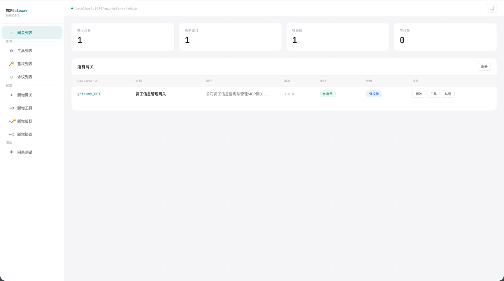
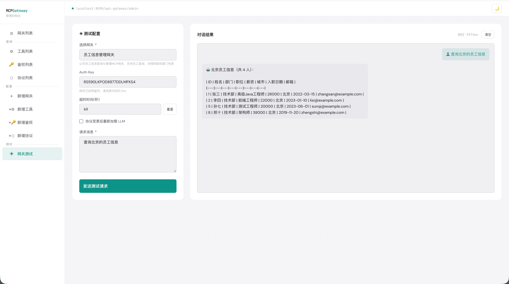
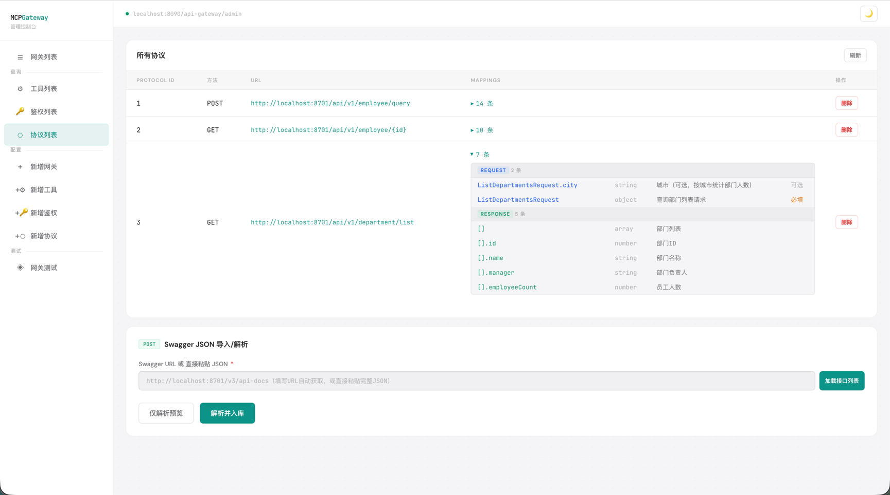

# MCP Gateway

基于 DDD 六边形架构的 MCP（Model Context Protocol）网关服务，代理多个 MCP Server，为 AI 客户端提供统一接入点。支持 OpenAPI 协议自动解析、SSE 传输、鉴权限流、内嵌 LLM 一键测试。

## 特性

- **MCP SSE 网关** — 代理多个后端 HTTP 服务，对外暴露统一 MCP SSE 端点
- **OpenAPI 自动解析** — 导入 Swagger JSON，自动生成协议配置和字段映射
- **鉴权 + 限流** — API Key 强校验、Guava 令牌桶按维度限流
- **管理控制台** — 网关/工具/协议/鉴权全生命周期管理，日间/夜间模式
- **LLM 内嵌测试** — 管理端直接发消息，LLM 通过网关调 MCP 工具验证全链路
- **DDD 六边形架构** — 7 模块分层，依赖倒置，充血模型

## 效果展示

<table>
  <tr>
    <td align="center"><b>管理后台总览</b></td>
    <td align="center"><b>LLM 网关测试</b></td>
  </tr>
  <tr>
    <td></td>
    <td></td>
  </tr>
  <tr>
    <td align="center" colspan="2"><b>协议 Mapping 展开</b></td>
  </tr>
  <tr>
    <td align="center" colspan="2"></td>
  </tr>
</table>

## 技术栈

JDK 21 · Spring Boot 3.5 · Spring AI 1.1.2 · MyBatis · MySQL 8.0 · Project Reactor · Guava · Retrofit2

## 快速开始

**环境要求：** JDK 21、Maven 3.9、Docker

### 本地开发

```bash
# 1. 启动 MySQL
docker compose -f docs/dev-ops/docker-compose-environment.yml up -d

# 2. 启动 demo-server（可选，用于测试网关 HTTP 路由）
git clone https://github.com/laterya/mcp-gateway-demo-server.git ../mcp-gateway-demo-server
cd ../mcp-gateway-demo-server && mvn spring-boot:run

# 3. 启动网关
mvn spring-boot:run -pl mcp-gateway-app
```

网关启动后访问：
- 管理控制台：`http://localhost:8090/api-gateway/index.html`（`admin` / `password123`）
- MCP SSE 端点：`http://localhost:8090/api-gateway/{gatewayId}/mcp/sse`

### Docker 部署

```bash
docker pull ghcr.io/laterya/mcp-gateway:latest

docker run -d --name mcp-gateway \
  -p 8090:8090 \
  -e SPRING_DATASOURCE_URL='jdbc:mysql://YOUR_MYSQL_HOST:3306/mcp_gateway?...' \
  -e SPRING_DATASOURCE_USERNAME=root \
  -e SPRING_DATASOURCE_PASSWORD=your-password \
  ghcr.io/laterya/mcp-gateway:latest
```

镜像仅含 Gateway 应用，MySQL 需自行提供并通过环境变量指向它。

### 配置 LLM（可选）

设置环境变量启用内嵌 LLM 测试功能：

```bash
export OPENAI_API_KEY=your-key
export OPENAI_BASE_URL=your-proxy-url
export OPENAI_MODEL=gpt-5.2  # 可选，默认 gpt-5.2
```

## 架构

```
                    ┌──────────────────────────────────┐
                    │          Admin Console            │
                    │    (管理控制台 · 静态 HTML)         │
                    └──────────────┬───────────────────┘
                                   │
┌──────────┐    SSE    ┌───────────▼────────────┐    HTTP/LLM    ┌──────────────┐
│  AI 客户端 │◄────────►│      MCP Gateway       │◄──────────────►│  后端 HTTP 服务 │
│ (Claude等) │          │   (SSE + JSON-RPC)     │               │  (demo-server)│
└──────────┘           └────────────────────────┘               └──────────────┘
```

### 模块结构

```
trigger ──→ case ──→ domain
   │          │        │
   │          └── types ┘
   │
infrastructure (实现 domain Port)
api       (DTO + Facade 接口)
app       (Spring Boot 启动模块)
```

| 模块 | 职责 |
|------|------|
| `types` | 通用响应、常量、异常 |
| `domain` | 6 个限界上下文：session / auth / protocol / gateway / admin / llm |
| `case` | 用例编排，责任链（会话创建 / 消息处理 / Admin CRUD） |
| `infrastructure` | Port 实现，MyBatis DAO，HTTP 客户端 |
| `api` | 对外 Facade 接口 + DTO |
| `trigger` | HTTP Controller |
| `app` | Spring Boot 启动模块，装配层 |

### MCP 调用流程

```
1. AI 客户端 GET /{gatewayId}/mcp/sse          → 建立 SSE 连接
2. 网关返回 endpoint 事件（含 sessionId）         → 握手完成
3. AI 客户端 POST initialize                     → 工具列表拉取
4. AI 客户端 POST tools/call                     → 网关路由到后端 HTTP 接口 → 返回结果
```

## 数据模型

```
mcp_gateway ──1:1── mcp_gateway_auth
       │
       └──1:N── mcp_gateway_tool
                      │
                      └──N:1── mcp_protocol_http
                      │
                      └──1:N── mcp_protocol_mapping
```

- **gateway** — 网关配置（名称、版本、鉴权模式）
- **auth** — API Key + 速率限制 + 过期时间
- **tool** — MCP 工具描述（名称、类型、绑定协议）
- **protocol_http** — HTTP 协议细节（URL、方法、超时）
- **protocol_mapping** — MCP 字段 ↔ HTTP 字段映射（request + response）

## 常用命令

```bash
mvn clean install -DskipTests                                     # 全量构建
mvn spring-boot:run -pl mcp-gateway-app                           # 启动网关
mvn test -pl mcp-gateway-app                                      # 运行测试
mvn test -pl mcp-gateway-app -Dtest="cn.laterya.ai.dao.**"        # DAO 测试
mvn test -pl mcp-gateway-app -Dtest="cn.laterya.ai.domain.auth.**" # 鉴权测试
```

## 项目结构

```
mcp-gateway/
├── mcp-gateway-app/              # 启动模块 (application.yml, MyBatis mapper, 静态资源)
├── mcp-gateway-api/              # 对外接口 + DTO
├── mcp-gateway-case/             # 用例编排 (责任链, Admin 编排, LLM 编排)
├── mcp-gateway-domain/           # 领域层 (6 个限界上下文)
├── mcp-gateway-infrastructure/   # 基础设施 (DAO, Repository, HTTP Client)
├── mcp-gateway-trigger/          # HTTP Controller
├── mcp-gateway-types/            # 通用类型
├── Dockerfile                    # 多阶段构建 (Maven → JRE)
├── docs/
│   ├── images/                   # 效果截图
│   └── dev-ops/
│       ├── docker-compose-environment.yml   # 本地开发 MySQL
│       └── mysql/sql/ai_mcp_gateway.sql     # 建表 + 种子数据
```
